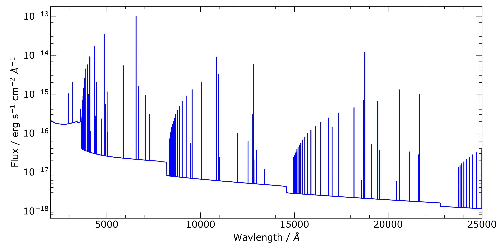

# NebularPy

  This is the repository for a python wrapper for Mischa Schirmer's NEBULAR software.

 ## Requirements & Installation

  You require to download and install NEBULAR from https://github.com/mischaschirmer/nebular .


  ```
  python setup.py install
  ```


 ##  Section 1:  Usage

```
import nebular

model = nebular.nebular(10000,20,np.arange(2000,25000,1.))
```
  <p align="middle">
     
  </p>
